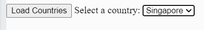

# Instructions  

**Important**: Do not modify the `mocha` and `chai` scripts, css and `<div>`

To run the test, reload and press the `Run Test` button

  ## Steps
  1. When the `Load Countries` button is loaded, use `axios` to read in the countries information from `countries.json`
  3. Create one `<option>` element for each country, setting the `value` attribute of each element to be the `v` key in each country object. That is, 
  4. Display all the `<option>` in the country `<select>`

## Expected Output


The HTML for the `<select>` should look something like this:

```
  <select id="countries">
    <option value="sg">Singapore</option>
    <option value="my">Malaysia</option>
  </select>
```