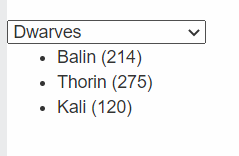

# Instructions  

**Important:** To run the test, reload your page or press the [Run] button, then click on [Run Test]

There are three JSON files, `dwarves.json`, `elves.json` and `humans.json`. The `<select>` dropdown allows the user to select one of them. When the user chooses any of the three, display  in the `<ul>` the name and age fo each character in the respective JSON file.

For example, if the user selects "Elves", they should see the following:

## Hints
* Use the __change__ event, instead of __click__ to detect if the user has selected a new option for the `<select>` element.

## Challenges
1. Solve this problem using only a single `if` statement.
2. Solve this problem **without** using **any** `if` statement.
